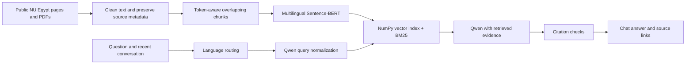

# Nile University Chat

A course project in NLP and large language models: a multilingual RAG chatbot for **Nile University in Sheikh Zayed, Giza, Egypt**. Its sources are `nu.edu.eg` and the university's school subdomains. It is an independent student project, not an official university service.

The interface is a simple chat with the Egyptian university's colors and logo. Ask in English, Arabic, Egyptian Franco (Arabizi), or a mixture. Answers link to the public university pages and PDF passages used.

## Run on Windows

Requires Python 3.12 and [Ollama](https://ollama.com/download/windows). An NVIDIA GPU is useful for Qwen; CPU inference is also possible but slower. No paid API or API key is required.

```powershell
.\setup.ps1
.\run.ps1
```

Open http://127.0.0.1:8000. `setup.ps1` installs dependencies, collects up to 160 public URLs, and builds the vector index. `run.ps1` starts Ollama if needed, downloads the configured model if absent, and starts the app. The initial model download is approximately 2.5 GB; the sentence encoder downloads separately if it is not already cached. Subsequent runs reuse both.

This workspace also supports an already downloaded portable Ollama in `.runtime/ollama/ollama.exe`; `run.ps1` detects it automatically. That runtime is not committed to GitHub. Fresh clones should install Ollama normally.

## Manual setup (Windows, Linux, macOS)

```bash
python -m venv .venv
# Activate .venv (Windows: .venv\Scripts\activate; Unix: source .venv/bin/activate)
python -m pip install -r requirements.txt
ollama pull qwen3:4b-instruct
# Keep Ollama running. If the desktop service is not running: ollama serve
python -m nu_chat ingest --max-pages 160
python -m nu_chat serve
```

The pinned requirements were resolved and tested on Windows/Python 3.12. On another operating system, if a platform-specific wheel is unavailable, resolve `requirements.in` with `uv pip compile requirements.in -o requirements-local.txt` and install that result.

Copy `.env.example` to `.env` to change the model, embedding device, data directory, or retrieval cutoff. The default generator is explicitly **`qwen3:4b-instruct`**. Do not substitute the ambiguous `qwen3:4b` tag: it currently resolves to a thinking variant and can exhaust a short answer budget before producing an answer.

## How it works



1. **Collect.** Start from reviewed URLs in `sources.json`, read bounded sitemap files, and follow in-scope links including embedded PDFs. Respect robots rules, delays, redirects, and a 20 MB download limit. Record failures, dates, PDF page numbers, and source URLs. Remove menus, scripts, forms, footers, and testimonials. Do not treat testimonials about other universities as NU policy.
2. **Chunk and embed.** Use `sentence-transformers/paraphrase-multilingual-MiniLM-L12-v2`, a 384-dimensional multilingual sentence encoder. Split the text with its tokenizer into 92-token windows with 18-token overlap; reserve title space inside the model's 128-token limit. Store normalized vectors and metadata together in an atomic NPZ file. Neighboring passage text is retained for answer context.
3. **Route language.** A small, readable heuristic distinguishes `en`, `ar`, `franco`, and `mixed`. This is a baseline classifier, **not a trained SBERT classification head**. Digits in dates or model names are not sufficient Franco evidence. The UI allows a reply-language override.
4. **Normalize.** Qwen translates Arabic/Franco queries to an English retrieval query and resolves follow-ups using the last few messages. A small Franco university glossary provides a limited fallback. General Franco transliteration is ambiguous; there is no claim of perfect coverage.
5. **Retrieve.** Cosine similarity, BM25, and title matching rank chunks. The generic university name is removed from the search focus because every document belongs to the same institution. Transparent topic rules prefer dedicated NU service pages for broad admissions, fees, location, scholarship, and program questions. Their matches use a lower semantic cutoff; other searches use the configured cutoff. Results are limited per URL and duplicate passages are removed.
6. **Generate.** Give Qwen the original and normalized question, reply language, recent conversation, and retrieved passages. Place the actual question after the evidence so questions inside source FAQs do not replace the user's request. A structured response contains the answer, citation IDs, and an explicit evidence-sufficiency flag. Validate citation IDs, reject truncated outputs, and abstain when evidence is missing. Model errors or invalid citations fall back to clearly labeled source passages; they are not silently reported as a successful generation.

The chatbot searches its collected corpus, not the live web on every message. Refresh it explicitly when university information changes.

## Project map

| File | Responsibility |
| --- | --- |
| `nu_chat/collect.py` | Public crawling, PDF/HTML extraction, collection reports |
| `nu_chat/language.py` | Language detection and Franco glossary |
| `nu_chat/retrieval.py` | Chunking, embeddings, vector storage, hybrid search |
| `nu_chat/generation.py` | Qwen query rewriting and cited answers |
| `nu_chat/api.py` | FastAPI endpoints and request validation |
| `nu_chat/evaluate.py` | Small retrieval/language evaluation |
| `static/` | Plain HTML, CSS, and JavaScript chat UI |
| `tests/` | Deterministic tests without model downloads |

There is no LangChain, vector database service, frontend build step, or cloud account dependency. NumPy is sufficient for this corpus and makes similarity search easy to inspect.

## Refresh and evaluate

```bash
python -m nu_chat collect --max-pages 160
python -m nu_chat index
python -m nu_chat evaluate
python -m nu_chat evaluate --with-llm
python -m pytest -q
python -m ruff check nu_chat tests
```

`ingest` combines `collect` and `index`. Use `--no-sitemaps` for a links-only crawl. The page bound is a maximum number of attempted URLs, not a promise of that many usable sources. Add discovered public URLs to `sources.json`; explicitly add another trusted domain only if it is relevant to NU Egypt.

Reports in `data/` include the collection inventory, skipped URLs, and per-question evaluation results. `evaluation/questions.json` is a small, hand-authored **development** set. Hit@5 measures whether at least one expected URL appears in the first five results; MRR@5 rewards earlier relevant results. These metrics do not measure factual correctness, citation entailment, Arabic fluency, or robustness across all Franco spellings. Expand the dataset and reserve a separate held-out test set for a stronger course evaluation.

See [the recorded development results and limitations](evaluation/RESULTS.md).

API: `GET /api/health`, `GET /api/sources`, `POST /api/chat`. Interactive API documentation is at `/docs`. Each chat response includes routing and retrieval diagnostics in JSON; these details are intentionally absent from the minimal chat UI. Conversation history is held in browser memory and resets on reload.

## Scope and limitations

- Public, accessible information only. This does not access private portals, credentials, student records, restricted files, or every document on the internet. Older unlinked PDFs can be added when their public URL is known. The crawler does not guess private paths.
- Scanned PDFs and image-only tables need OCR, which is not included. JavaScript-only content and externally hosted embeds may be skipped. Check the collection report rather than assuming complete coverage.
- University sites contain old pages, contradictory fees, and mixed academic years. A fetch date is not a policy's effective date. Confirm fees, deadlines, and admission decisions with the university.
- Valid citation numbers are not a proof that every generated claim is supported. Prompt-injection defenses and the retrieval threshold reduce errors but do not guarantee correctness. Review answers manually for the final presentation.
- The server binds to loopback. Internet deployment would require authentication, rate limits, request monitoring, and a deliberate model-hosting plan.
- Source content and model/runtime files stay out of Git. See [asset attribution](docs/ASSETS.md) for the university logo.

## References

- [Nile University, Egypt](https://nu.edu.eg/)
- [Sentence-BERT paper](https://aclanthology.org/D19-1410/)
- [Multilingual MiniLM model card](https://huggingface.co/sentence-transformers/paraphrase-multilingual-MiniLM-L12-v2)
- [Qwen3 4B Instruct in Ollama](https://ollama.com/library/qwen3:4b-instruct)
- [Ollama chat API](https://docs.ollama.com/api/chat)
